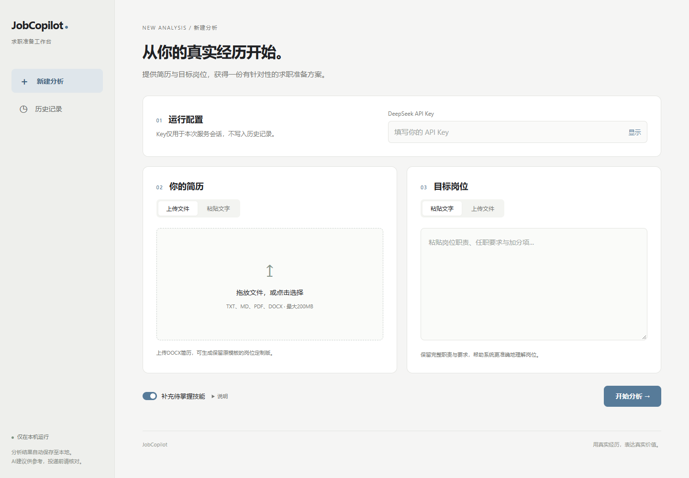

# JobCopilot

## 项目简介

JobCopilot 是一个在本机运行的 AI 求职辅助工具。输入简历和目标岗位描述（JD），
即可获得岗位匹配分析、简历优化建议、面试问答、四周学习计划和投递招呼语。
上传 DOCX 简历时，还可基于原 Word 模板生成岗位定制版。

技术栈：HTML/CSS/原生 JavaScript、FastAPI、Python、DeepSeek。
多个分析模块按固定流程依次执行，不依赖大型智能体编排框架。
网页使用灰白黑与低饱和蓝色。
包含首页、新建分析、两页结果和历史记录；原 Streamlit 页面仍保留作为回退。



## Windows便携版（无需Python）

便携包发布后，可在本项目的[Releases页面](https://github.com/BSD-001/JobCopilot/releases)
下载 `JobCopilot-Windows-x64.zip`。如果尚无同名附件，请先使用下方源码启动方式。

1. 将ZIP“全部解压缩”，不要在压缩包里直接运行。
2. 打开 `JobCopilot` 文件夹，双击 `JobCopilot.exe`，网页会自动打开。
3. 保留运行窗口，填自己的DeepSeek Key即可分析；分析结束后再关闭运行窗口。

目标平台为Windows 10/11 x64，不需要安装Python或依赖。不要单独移动EXE或删除
旁边的 `_internal` 文件夹。重复启动会复用已运行的便携版；其他服务占用端口时会选择空闲端口。
历史保存在 `%LOCALAPPDATA%\JobCopilot\history`，更新程序不会自动覆盖它。
源码版历史不自动迁移。完整说明见[便携版使用说明](docs/Windows便携版使用说明.txt)。

便携版仍通过DeepSeek API分析，需要网络和用户自己的Key，真实调用会产生费用。
当前未做代码签名，遇到系统安全提示时请核对官方仓库、附件及SHA256，不要关闭安全检查。
`Code → Download ZIP` 下载的是源码，不包含已经构建的EXE。

## 快速开始（Windows）

需要 Python 3.10 或更高版本。下载本仓库后，在项目目录打开终端：

```powershell
python -m venv .venv
.\.venv\Scripts\python.exe -m pip install -r requirements.txt
.\.venv\Scripts\python.exe scripts\run_web.py
```

也可以在安装依赖后双击 `启动JobCopilot.bat`。浏览器打开
`http://localhost:8501/`，按以下步骤使用：

1. 填写自己的 DeepSeek API Key，不要把 Key 提交到 GitHub。
2. 上传或粘贴简历和岗位描述，按需选择“补充待掌握技能”。
3. 点击“开始分析”，等待页面显示各个真实处理阶段。
4. 查看匹配分析、优化建议、待补充信息和折叠面试问答。
5. 进入第二页查看学习计划、复制招呼语、下载报告及可用的定制简历。

历史结果保存在本机，可重新查看或确认后永久删除。
若8501已运行本项目，直接访问现有页面；若被其他服务占用，可运行：

```powershell
.\.venv\Scripts\python.exe scripts\run_web.py --port 8502
```

真实分析会调用 DeepSeek 并产生费用；一轮分析包含多个模型请求，失败可能自动重试。
网页虽在本机运行，分析材料仍会发送到 DeepSeek API，请先脱敏。
生成建议和Word版式需要人工核对，匹配评分不代表招聘结果。

无需Key的浏览器演示可运行 `python tests/browser_preview.py`（建议使用虚拟环境中的Python），
打开 `http://localhost:8503/`。此入口使用虚构数据，不调用付费接口。

## 功能概览

用户输入简历和目标岗位描述后，系统会依次完成：

1. 简历解析
2. 岗位描述解析
3. 匹配度分析
4. 简历优化
5. 面试问题预测
6. 三十天学习计划
7. 岗位定制简历生成（改写、删减低相关经历、技能补强）
8. 最终报告和独立短招呼语生成

## 项目状态

当前已经完成最小可用版本：

- 八个结构化智能体
- 一个报告生成智能体
- DeepSeek 调用客户端
- 文本、Word、便携式文档格式读取
- 保留 Word 原模板的岗位定制简历，可删除低相关经历
- 最多补写 3 项待补齐技能，并保留技能补强记录
- 报告末尾生成 65 个字符以内的岗位定制打招呼语
- 浏览器侧栏保存并浏览历史分析记录
- 定制简历按目标岗位自动命名
- 命令行主流程
- 浏览器界面
- 双击启动文件
- 原有回归与新版网页、简历写作规则的离线自动化测试

## 项目结构

```text
JobCopilot/
├── agents/
│   ├── base.py
│   ├── resume_parser.py
│   ├── jd_parser.py
│   ├── match_agent.py
│   ├── resume_optimizer.py
│   ├── interview_agent.py
│   ├── learning_plan.py
│   ├── greeting_agent.py
│   ├── tailored_resume_agent.py
│   └── report_agent.py
├── core/
│   ├── llm_client.py
│   ├── prompt_templates.py
│   ├── document_reader.py
│   ├── resume_template.py
│   ├── resume_writing.py
│   └── history_store.py
├── data/
│   ├── resume.txt
│   └── jd.txt
├── docs/
│   ├── web-preview.png
│   └── 新版验收记录.md
├── output/
├── tests/
├── web/
│   ├── index.html
│   ├── styles.css
│   └── app.js
├── scripts/
│   └── run_web.py
├── app.py
├── webapp.py
├── 启动JobCopilot.bat
├── main.py
├── requirements.txt
└── README.md
```

## 环境要求

- Python 3.10 或更高版本
- pip 包管理工具
- DeepSeek 应用程序密钥

## 安装步骤

```powershell
cd JobCopilot
python -m venv .venv
.\.venv\Scripts\Activate.ps1
python -m pip install -r requirements.txt
```

## 配置应用程序密钥

新版网页直接在密码式输入框中填写 Key，无需配置环境变量。
命令行或旧版入口可在当前终端中设置 DeepSeek 应用程序密钥：

```powershell
$env:DEEPSEEK_API_KEY = "你的应用程序密钥"
```

这个环境变量只在当前终端会话中有效。关闭终端后需要重新设置。

## 运行方法

### 浏览器界面

```powershell
.\.venv\Scripts\python.exe scripts\run_web.py
```

也可以直接双击项目根目录中的 `启动JobCopilot.bat`，浏览器打开
`http://localhost:8501/`。服务只监听本机，不自动结束占用端口的其他进程。
若旧服务还在运行，可先关闭旧终端，或使用旁路预览：

```powershell
.\.venv\Scripts\python.exe scripts\run_web.py --port 8502
```

旧版 Streamlit 回退入口：

```powershell
.\.venv\Scripts\python.exe -m streamlit run app.py --server.port 8504
```

浏览器界面支持：

- 上传简历文件或直接粘贴简历内容
- 上传岗位描述或直接粘贴岗位描述
- 在页面中输入 DeepSeek 应用程序密钥
- 在线查看报告
- 下载 Markdown 报告
- 上传 Word 简历后下载岗位定制简历
- 可选择是否补写未掌握的目标岗位技能
- 在历史页重新打开之前的分析报告和定制简历
- 确认后永久删除单条历史及其对应报告、定制简历和元数据
- 分析过程中显示真实阶段，页面切换不会丢失当前输入
- 查看四字能力标签的项目表达、待补充信息与核对提醒

API Key 仅存在于新网页内存和本次请求，不写入浏览器持久存储或历史。
只有上传 DOCX 且成功生成定制文件时才开放 Word 下载；PDF、TXT、MD 或
粘贴简历仍支持完整分析。扫描型 PDF 需先转为可复制文字。

新版历史额外保存 `analysis.json` 供分区展示，旧记录无需迁移，仍可查看完整报告
和下载原文件。历史数据位于 `output/history/`，永久删除不能撤销。

### 命令行方式

```powershell
python main.py --resume data/resume.txt --jd data/jd.txt --tailored-resume output/tailored_resume.docx
```

程序会在以下位置生成报告：

```text
output/report.md
output/tailored_resume.docx
```

### 不联网演示

没有 DeepSeek 应用程序密钥时，可以运行：

```powershell
.\.venv\Scripts\python.exe scripts\run_offline_demo.py
```

此模式使用模拟客户端，会生成：

- `output/demo-report.md`
- `output/demo-tailored-resume.docx`

## 支持的输入文件

- 普通文本文件：`.txt`
- Markdown 文件：`.md`
- 便携式文档格式文件：`.pdf`
- Word 文档：`.docx`

## 输出报告包含的内容

1. 简历和岗位描述的结构化信息
2. 匹配度评分、匹配点和缺失点
3. 基于原有经历生成的岗位优化建议与待补充信息
4. 十个高频面试问题和参考回答
5. 按周拆解的三十天学习计划
6. 项目成果摘要
7. 岗位定制简历的调整结果
8. 报告末尾的“线上投递打招呼语”，包含岗位、关键技能、相关经历和看简历请求

## 运行测试

```powershell
.\.venv\Scripts\python.exe -m unittest discover -s tests -v
```

测试包含原27项回归，以及新版接口、文件下载、历史删除隔离、旧历史兼容、
进度回调、简历写作规则和Windows便携版路径与启动适配。所有自动测试使用虚构材料和模拟客户端，不调用付费接口。
首版验收、后续59项离线回归、浏览器及便携包检查的证据和限制见[新版验收记录](docs/新版验收记录.md)。

浏览器离线验收可运行下列临时服务；其历史保存在临时目录，停止服务后清理。
该入口仅用于验收，不是正常 DeepSeek 服务：

```powershell
.\.venv\Scripts\python.exe tests\browser_preview.py
```

打开 `http://localhost:8503/`，使用任意非空测试 Key，并提供虚构简历和岗位。

## 构建Windows便携包（开发者）

在64位Windows和本项目虚拟环境中执行：

```powershell
.\.venv\Scripts\python.exe -m pip install -r requirements-build.txt
.\.venv\Scripts\python.exe scripts\build_windows.py
```

每次构建在 `output/windows/build-*/` 中生成新的便携ZIP、SHA256文件和离线自检结果。
构建只收集程序及网页资源，不包含Key、上传原件、历史、个人笔记或旧Streamlit入口。
自检不调用付费接口，覆盖网页资源、Markdown、Word/PDF、独立历史读写及SDK初始化。
使用PyInstaller的文件夹模式打包运行库；资源路径沿用[官方运行时说明](https://pyinstaller.org/en/stable/runtime-information.html)。

## 核心设计

- `StructuredAgent` 统一处理结构化输出任务。
- 每个智能体只负责一个明确任务。
- 招呼语独立生成并限制为 65 个字符，再由程序强制放到报告末尾，避免被报告模型扩写。
- 所有提示词集中在 `core/prompt_templates.py`。
- 新网页从本次请求读取密钥；命令行可从环境变量读取，均不写入代码。
- 模型输出解析失败时自动重试。
- 测试使用模拟客户端，不访问网络，不产生费用。
- Word 模板回填可替换或删除指定段落，不改变其余照片、字体、颜色和整体版式。
- 历史记录保存在本地 `output/history/`，下载名称会转换成“岗位名岗位-定制简历.docx”。
- 简历优化规则独立维护：句首四字能力标签、具体动作和真实结果、克制表达。
  不读取 `resume-agent` 的个人知识库、专用提示词或模板。
- 缺失数据只列入 `pending_items` 和报告，下载简历不带新增待补充标记。
  数字与标签检查只能发现部分问题，不能替代人工核对事实和排版。
- 新版接口单进程执行，每次只允许一个分析；重启会清空进行中的任务，
  已保存的历史和下载文件不受影响。浏览器刷新可继续查询尚未重启的活动任务。

## 已知限制

- 尚未接入真实向量数据库。
- 自动测试使用模拟客户端，不能替代真实接口、输出文案和文档分页抽查。
- 便携式文档格式和图片型文档中的文字识别暂未接入。
- 岗位定制简历目前只支持 Word 模板。
- 定制过程只改写、删除或补写已有段落，不自动新增版面或重新排列章节。
